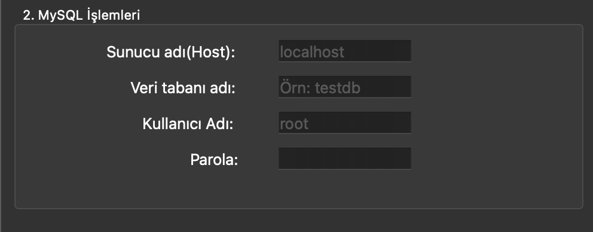

# CsvToSql Kurulum Rehberi

Bu proje, Python dilinde yazılmıştır ve çalışmak için iki temel harici kütüphaneye ihtiyaç duyar: `PyQt6` (arayüz için) ve `mysql-connector-python` (veritabanı bağlantısı için).

Aşağıdaki adımları izleyerek projeyi çalıştırmak için gerekli ortamı kurabilirsiniz

---

## Global Olarak Yükleme(Tavsiye edilmez)

Sanal alan oluşturmadan doğrudan indirme yapmaktır.
Bu adımlarda bir hata alırsanız `pip3` yerine `pip` kullanmayı deneyiniz.

#### PyQt6

İlk öncelikle PyQt6 kütüphanesini kurunuz.

```bash
pip3 install PyQt6
```

#### MySQL-Connector

Daha sonra ise mysql-connector kütüphanesini kurunuz.

```bash
pip3 install mysql-connector-python
```

!!! error
    Eğer `pip3` hatası aldıysanız, ya da program böyle bir komut bulamadıyssa `pip` kullanmayı deneyiniz.


---

## Sanal Makine Olarak Yükleme(Tavsiye Edilir)

Proje bağımlılıklarını bilgisayarınızdaki diğer Python projelerinden ayırmak için bir sanal ortam (`venv`) kullanmanız şiddetle tavsiye edilir.

### Mac/Linux/Windows Sanal Ortam Oluşturma

Proje klasörünün içindeyken şu komutu çalıştırın:

```bash
python3 -m venv venv
```

!!! error
    Eğer `python3` hatası aldıysanız, ya da program böyle bir komut bulamadıyssa `python` kullanmayı deneyiniz.

### Mac/Linux Sanal Ortam Aktive Etme

```bash
source venv/bin/activate
```

### Windows İçin Aktive Etme

```bash
.\venv\Scripts\activate
```

### Gerekli Kütüphanelerin Kurulması

Sırayla şu komutları çalıştırın:

```bash
pip3 install PyQt6
pip3 install mysql-connector-python
```

!!! error
    Eğer `pip3` hatası aldıysanız, ya da program böyle bir komut bulamadıyssa `pip` kullanmayı deneyiniz.

---

## Programı Çalıştırma

Ana klasördeki main dosyasını seçiniz ve çalıştır butonuna basınız.

Ya da terminal üzerinden çalıştırabilirsiniz

```bash
python3 main.py
```

---

# Projenin Çalışması

## MainWindow

{ width="312" }

Program açıldığında bizi böyle bir ekran karşılayacaktır. Burada bizden gerekli bilgileri girmemizi isteyecektir. 

## 1. Veri Seçme

İlk kısımda `Dosya Seç` butonuna basarak Csv dosyasını seçiyoruz. 

{ width="437" }

{ width="450" }

## 2. MySQL İşlemleri

Bu kısımda server'a bağlanmak için gerekli bilgileri giriyoruz. 

{ width="471" }


## 3. Veri Alma, Kaydetme

Buradan istersek yazdığınız bilgileri `KAYDET` butonuna basarak kaydedebilir, Ya da `DOSYA SEÇ` butonuna basarak da kaydettiğiniz bilgileri tek tek yazmak yerine yükleyebilirsiniz.


## 4. Dönüşüm ve Tablo Ayarı

Bu kısımda ise tablo adını belirliyorsunuz. 
İstersenizde seçenekleri de seçebilirsiniz.
`ÇALIŞTIR` butonuna bastığınızda program çalışacaktır.


---

# Projenin Çalışma Örneği

Programı çalıştırmadan önce, rastgele veriler içeren CSV dosyasını göstermek istiyorum:


Burada 100 satırlık bir veri var. Çalıştır butonuna bastığımda artık bu veriler mysql formatında olmuş olacak


Burada görmüş olduğunuz gibi veriler aktarılmış oldu. Sadece bir kısmını gösterdim ama mantık bu şekilde.

---

# Projenin Geleceği

## Eksikler Ve Hatalar

MySQL bilgilerini kaydetmek için kullandığınız buton; `KAYDET` şu anda çalışmamaktadır.

`Tablo yoksa oluştur` seçeneği şu anda çalışmamaktadır. 

## Sorunların Giderilmesi

Yapay Zeka entegrasyonu ile özellikle büyük veri setlerinde gelen verinin hangi tür olduğunu daha iyi kavrayacak. 